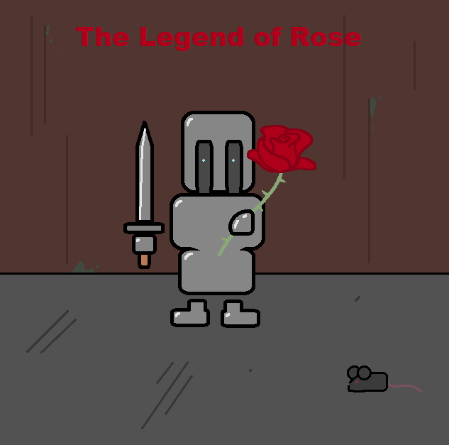
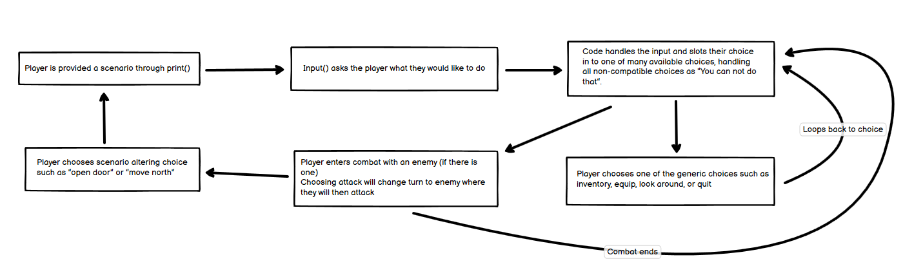
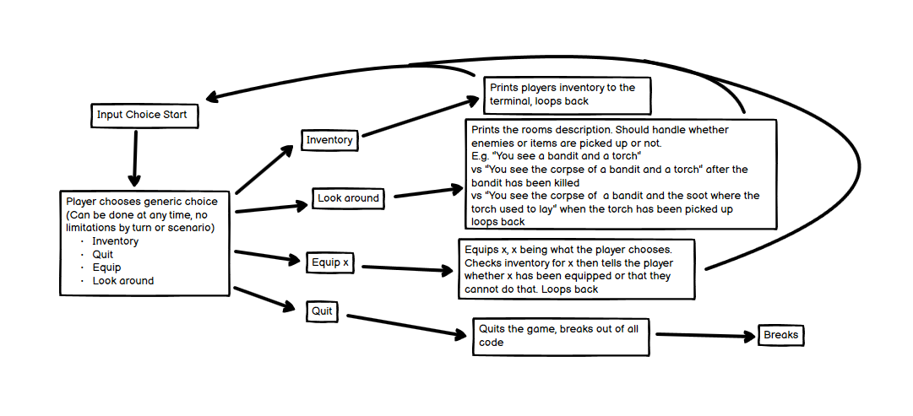
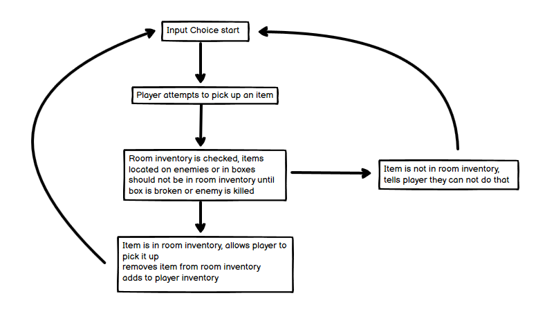
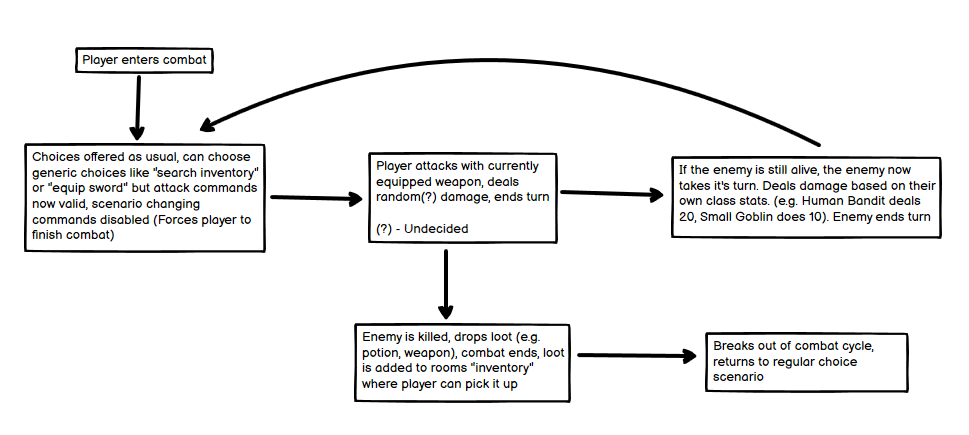
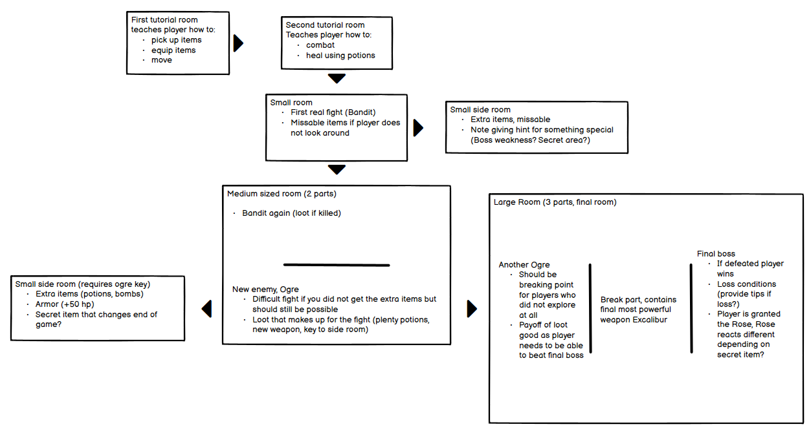

# The Legend of Rose Table of Contents

- [The Legend of Rose](#the-legend-of-rose)

- [Initial UX Goals and Designs](#initial-ux-goals-and-designs)

- [Features of the Website](#features-of-the-website)

- [Testing and Bug Solving](#testing-and-bug-solving)

- [Deployment](#deployment)

- [Credits](#credits)

# The Legend of Rose

The Legend of Rose is a text based adventure game designed to allow the player to get a little silly. With a story not to be taken seriously the player is thrust in to your regular text-based dungeon crawler with some special hidden actions and a goal of retrieving the legendary Rose, said to hold the power of flattering anyone.

The game is played entirely within the console and handles user inputs as to tell them whether they can do something or not. A creative and explorative player will have a better time with the game. Have fun!

## Initial UX Goals and Designs

As this game is entirely within a console from the Code Institute Template, the wireframes of this project are instead flowcharts of how the game works in the background. There are also no UI elements except for some ASCII art at points, so there are no initial website layout designs.

The main gameplay loop is something I wanted to keep simple and within the scope of the project. Ideally given infinite time I would have many branching trees of possibilities however for this I wanted to keep the game somewhat linear in its loop. 

The player will essentially run through similar scenarios over and over with the main game changer being enemy health, items in the room, and side room choices. As such the main loop needed only be a simple few steps between each loop back.

The generic choices would be a handful of choices that are always offered to the player. For example a player should always be able to quit the game, or look at their inventory, without using up a turn in combat or progressing through the game.

Picking items up should be the same idea for a few different things, like equipping items, where in essence the game should check if the player can actually do this actions first, by means of checking the room inventory. If the item is in the room, the player can pick the item up and it is then removed from the rooms inventory.

## Testing and Bug Solving

- Equip skip bug

- going back complicated