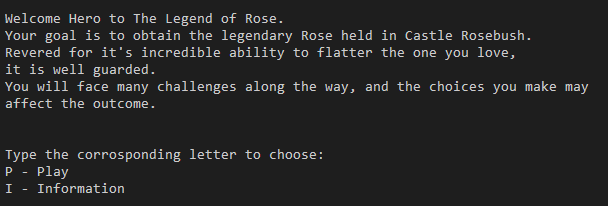
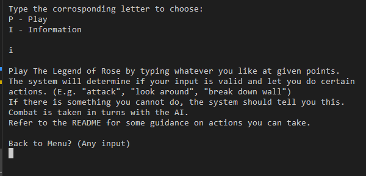
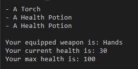
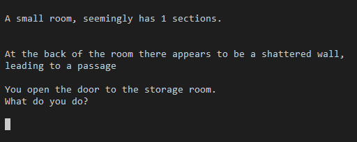
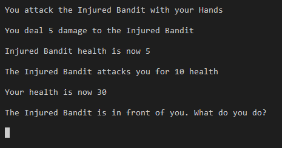
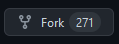

# The Legend of Rose Table of Contents

- [The Legend of Rose](#the-legend-of-rose)

- [How to Play](#how-to-play)

- [Initial Goals and Designs](#initial-goals-and-designs)

- [Features](#features)

- [Testing and Bug Solving](#testing-and-bug-solving)

- [Deployment](#deployment)

- [Credits](#credits)

# The Legend of Rose


The Legend of Rose is a text based adventure game designed to allow the player to get a little silly. With a story not to be taken seriously the player is thrust in to your regular text-based dungeon crawler with some special hidden actions and a goal of retrieving the legendary Rose, said to hold the power of flattering anyone.

The game is played entirely within the console and handles user inputs as to tell them whether they can do something or not. A creative and explorative player will have a better time with the game. Have fun!

## How to Play
<hr>

This is a text based adventure game and as such is played by inputting actions when asked, this action is then compared against a list of allowed actions for the scenario and then you are told whether it is valid or not. 

Combat is taken in turns, so after you attack, the enemy gets to attack. You can only heal during combat, however this will not use a turn. Use your potions wisely and you might take home the Rose!

Here is a small list of example actions that you can do:
- look around
- pick up
- attack
- heal
- inventory
- equip

If you are stuck in a room, try looking around, and then performing an action contextually appropriate, for example:
- "You see a broken wall"
- Try: "Break wall" and you might be taken to the next scenario.

## Initial Goals and Designs
<hr>

As this game is entirely within a console from the Code Institute Template, the wireframes of this project are instead flowcharts of how the game works in the background. There are also no UI elements except for some ASCII art at points, so there are no initial website layout designs.


The main gameplay loop is something I wanted to keep simple and within the scope of the project. Ideally given infinite time I would have many branching trees of possibilities however for this I wanted to keep the game somewhat linear in its loop. 

The player will essentially run through similar scenarios over and over with the main game changer being enemy health, items in the room, and side room choices. As such the main loop needed only be a simple few steps between each loop back.


The generic choices would be a handful of choices that are always offered to the player. For example a player should always be able to quit the game, or look at their inventory, without using up a turn in combat or progressing through the game.


Picking items up should be the same idea for a few different things, like equipping items, where in essence the game should check if the player can actually do this actions first, by means of checking the room inventory. If the item is in the room, the player can pick the item up and it is then removed from the rooms inventory.


## Features
<hr>

The game features multiple different scenarios that get progressively more difficult, but reward players who explore their environments and are inquisitve about the game. The game can progress differently in a simple way just by whether or not the player decided to pick up the items in a room, or investigate a hidden room.



* Menu 
    - The Menu gives the player a very simple story and goal.
    - Offers the player two options, P for play, or I for Information



* Information
    - Provides the player with guidance on how to play the game, in case they missed the README or simply could not access it.
    - Gives some examples of actions the player can do
    - Waits for player to want to go back



* Inventory
    - Shows the player their inventory, so they can keep track of the items they have acquired
    - Tells the player their currently equipped weapon, max health, and current health.



* Looking around
    - At all points in the game the player can look around
    - This tells the player what is in the rooms inventory, the size of the room and reads out the special flavor text assigned to the room



* Combat
    - Combat is turn based and so when a player attacks, the enemy then gets a turn.
    - The combat ends when either the player or the enemy is defeated.
    - You can only heal during combat, so the player must use their potions wisely.
    - Loot from the enemy is added to the rooms inventory when they are defeated and as such the player can pick up the spoils.

* Future Features
    - Given unlimited time I would love to flesh this game out fully with tons of different options per room.
    - Multi-enemy combat
    - Sprawling side paths instead of singular side rooms/closets

## Testing and Bug Solving
<hr>

### Bugs I Solved

This project honestly had a million tiny bugs here and there that were solved out and not worth mentioning in a commit. As such the below are the "largest" most memorable bugs I have had to squash.

- Equip skip bug
    - This bug was causing any action after equipping a weapon to tell the player "You can't do that", this was due to how the game was all run inside main() and as such after equipping an item, the player was sent back to scene_two for instance, but not within main()
    - It was fixed by removing everything from main() and instead just using main() to start the game and get it set up for the player. The scenes then ran in to themselves.

- Going back a room not working
    - Going back a room was bugged out and acting strangely, similar to the last bug due to running a scene outside of main. Players would go from scene_two within main() to scene_one outside of main() and then enter scene_two again outside.
    - Again, fixed by making main() the start of the game and nothing else.

- Picking up items for loop
    - A large snag my project had for a while was the ability to pick items up. I was initially working with a for loop that went through all the items in a room, and for each item in that room, passed it through the Player pickup() method. This however would only work for a certain number of items, and never the full number of items in the room.
    - This was solved by instead introducing the .extend() method to the players inventory, from the room inventory, then removing all the items in the room subsequently. A simple but elegant solution I can thank Gemma from Code Institute for helping me solve.

- The player was not able to die in combat
    - Another snag for a little while was that the player was not able to die in combat. The combat code was written as ```while player.health and enemy.health > 0```.
    - This was solved by the realization that this code was first testing if player.health was True. Any number, even a minus, would return True for this except for 0 and more often than not the player, if they died, were at a negative number. I simply changed the code to ```while player.health > 0 and enemy.health > 0```

### Testing

- Passed the code through a PEP8 linter and confirmed there are no problems except it not liking my x_item variable being outside the for loop associated with it. This was the only way I could find to not repeatedly tell the player they don't have an item until they land on the item they do have.
- Invalid inputs are all handled by telling the player they cannot do that. I initially opted for try-except blocks however felt it was uneccessary in the context of a text based adventure game.
- Tested on both my terminal and the Heroku terminal.

## Deployment
<hr>

This website was deployed to Heroku. The link can be found [here](https://legend-of-rose.herokuapp.com/)

**To clone this repository:**

* Go to the top of the page and click "Fork" in the top right  
* Or by clicking "Code" at the top of the repository then copying the URL 
* Use ```git clone url``` in your Git Bash. 

**To deploy this site locally:** 

* Sign up to https://gitpod.io/ and install the extension for your browser. 
* After this is done you can click the "Gitpod" button at the top of this repository  
* This will automatically set up a new workspace for you.

**To deploy this site remotely to Heroku:**

* Fork or clone this repository
* Create a new Heroku app
* Set the buildpacks to Python and NodeJS in that order
* Link the Heroku app to the repository through GitHub
* Click on Deply

## Credits
<hr>

- Code Institutes Python Essentials Template
- Knightfall: A Daring Journey for the inspiration